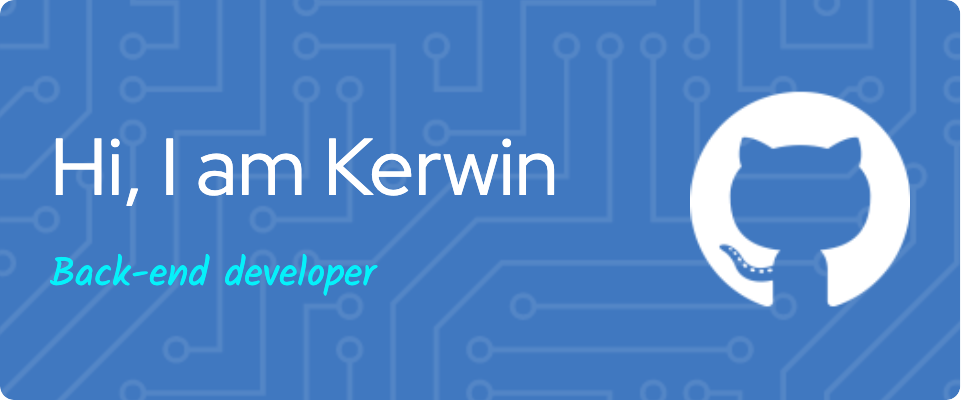

# Kerwin #tkoleo84119

Hello, I'm Kerwin. Between 2020 and 2021, I worked as a Clinical Research Associate. However, during that time, I discovered my passion for coding and decided to make a career shift. I am very excited to continue my journey in the software development field.

As a Junior backend engineer, I am experienced in building web applications using Nest.js, TypeScript, and Sequelize (ORM for PostgreSQL) for the backend and PostgreSQL as a database. I am constantly trying to learn new technology, develop my skills, and work well in a team.

---

### 💻 Operating system & Languages

### 🗄 Database & ORM(ODM)

### 🛠 Technologies & Tools

---

### 📧 Get in touch

<!---
tkoleo84119/tkoleo84119 is a ✨ special ✨ repository because its `README.md` (this file) appears on your GitHub profile.
You can click the Preview link to take a look at your changes.
--->
